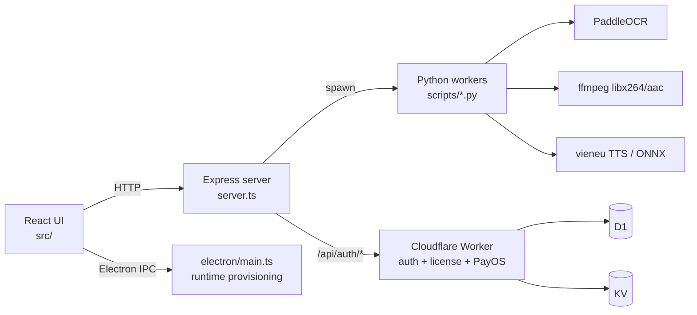

<div align="center">

# 26Dub (DubbinTool)

**AI video dubbing & auto-subtitle desktop app for Vietnamese creators**

Auto-dub · OCR subtitle extraction · Translation · Voice cloning · MP4 rendering

[](https://dubbintool.io.vn)
[](#-requirements)
[](https://www.electronjs.org/)
[](https://react.dev/)
[](https://www.typescriptlang.org/)
[](https://www.python.org/)
[](#-license)

**🌐 Website:** [dubbintool.io.vn](https://dubbintool.io.vn)

</div>

---

## 📑 Table of Contents

- [About](#-about)
- [Features](#-features)
- [Tech Stack](#-tech-stack)
- [Architecture](#-architecture)
- [Requirements](#-requirements)
- [Getting Started](#-getting-started)
- [Available Scripts](#-available-scripts)
- [Project Structure](#-project-structure)
- [OCR Engine](#-ocr-engine)
- [Video Render Engine](#-video-render-engine)
- [TTS & Dubbing Pipeline](#-tts--dubbing-pipeline)
- [Licensing & Payments](#-licensing--payments)
- [Troubleshooting](#-troubleshooting)
- [License](#-license)

---

## 💡 About

**26Dub** is a desktop application (Electron + local server) that turns any video into a fully dubbed, subtitled Vietnamese production automatically. Upload a video and the app handles the entire pipeline:

1. **OCR / transcription** — extract burned-in subtitles from video frames with PaddleOCR
2. **Translation** — Gemini-powered translation with per-project glossary and style control
3. **TTS dubbing** — Vietnamese text-to-speech with voice cloning (vieneu model) and word-level alignment
4. **Rendering** — native FFmpeg MP4 export with subtitle overlay, blur boxes, and ROI masking over the original subtitles

Built for Vietnamese content creators running faceless channels, news shorts, and dubbing workflows.

## ✨ Features

| Area | What it does |
|---|---|
| **Auto Dubbing** | Batch-dub a whole folder of videos: OCR → translate → TTS → render, with checkpoint/resume and real progress per part/sentence/batch |
| **OCR Subtitle Extraction** | Frame-by-frame subtitle detection with multi-frame dedupe, region-of-interest (ROI) selection, and Latin-artifact filtering |
| **AI Script Shorts** | Script-to-shorts pipeline with dubbing, region blur, and thumbnail-aware layout |
| **Translation Studio** | Glossary + style presets per tab/mode, sentence-level editing before TTS |
| **Narration & TTS** | Vietnamese neural TTS with voice cloning, one-trim-per-clip policy, no voice overlap |
| **Timeline Editor** | Per-cue subtitle timing, sizing, and styling with preview identical to final render |
| **Copyright Checker** | Video similarity detection for pre-upload risk checks |
| **Project Library** | Save/resume projects with checkpoints producing identical output to fresh runs |
| **License & Payments** | Account auth (email/Google), PayOS checkout, HWID-bound licenses, admin panel |

## 🧱 Tech Stack

- **Desktop shell:** Electron (main + preload, native FFmpeg & OCR runtime provisioning)
- **Frontend:** React 19, TypeScript, Tailwind CSS, Framer Motion, lucide-react
- **Local server:** Express (`server.ts`, esbuild-bundled) — proxies OCR/render/TTS Python jobs and `/api/auth/*`
- **AI:** Google Gemini API (translation), PaddleOCR (subtitle OCR), ONNX Runtime (vocal separation / TTS graph)
- **Media:** native `ffmpeg.exe` (libx264/aac), Python worker scripts under `scripts/`
- **Backend services:** Cloudflare Workers (auth + license + PayOS) with D1 + KV
- **Build tooling:** Vite, esbuild, electron-builder

## 🏗 Architecture



## 📋 Requirements

- **OS:** Windows 10/11 x64
- **Node.js:** 20+
- **Python:** 3.11+ with a virtual environment (`.venv`) for OCR/TTS/render workers
- **GPU:** optional — OCR and TTS prefer CUDA, automatically fall back to CPU
- **API keys:** Gemini key set in the in-app Settings page

## 🚀 Getting Started

```bash
# 1. Install dependencies
npm install

# 2. Configure API keys
#    Launch the app and open Settings → set Gemini API key

# 3. Run in development (local server + Vite)
npm run dev

# 4. Run the Electron shell against a built bundle
npm run build:electron
npm run electron:dev
```

## 📜 Available Scripts

| Command | Description |
|---|---|
| `npm run dev` | Start the local dev server (tsx) |
| `npm run build` | Build web bundle (Vite) + server bundle (esbuild) |
| `npm run build:electron` | Build app + Electron main/preload bundles |
| `npm run electron:dev` | Launch Electron with current build |
| `npm run electron:pack:update` | Package Windows installer (update channel) |
| `npm run electron:pack:full` | Package Windows installer (full channel) |
| `npm run build:ocr-engine` | Build the packaged OCR engine distribution |
| `npm run lint` | TypeScript check (`tsc --noEmit`) |
| `npm run test:ocr-dedupe` | OCR multi-frame dedupe regression test |
| `npm run test:subtitle-optimizer` | Subtitle optimizer test |
| `npm run test:subtitle-sizing` | Subtitle sizing test |
| `npm run test:video-hub` | Video hub test |

## 🗂 Project Structure

```
.
├── server.ts              # Express local server (OCR/render/TTS job runner, auth proxy)
├── electron/              # Electron main, preload, native runtime provisioning
│   ├── main.ts
│   ├── preload.ts
│   ├── ffmpegRuntime.ts
│   ├── ocrRuntime.ts
│   └── separationRuntime.ts
├── src/
│   ├── flows/studio/      # StudioWorkspace — main app flow & state
│   ├── tabs/              # Feature tabs (Auto Dubbing, Shorts, Translation, Settings…)
│   ├── lib/               # Auth, license, API clients
│   └── types.ts
├── scripts/               # Python workers & build/test helpers
│   ├── ocr_video_stream.py
│   ├── ocr_frame.py
│   ├── render_video.py
│   ├── vieneu_tts.py
│   └── align_voice_words.py
├── cloudflare/auth-worker # License/auth/PayOS Cloudflare Worker (D1 + KV)
├── build/                 # electron-builder configs & installer scripts
└── resources/             # Bundled runtimes (ocr-engine, ffmpeg, models)
```

## 🔍 OCR Engine

PaddleOCR runs only through the local Python environment. The server uses
`scripts/ocr_video_stream.py` for video extraction and `scripts/ocr_frame.py`
for frame/batch requests. GPU is preferred; CPU is used automatically when GPU
is unavailable. Set `OCR_TEXT_MODE=chinese` (default) to keep CJK/mixed text
and reject Latin-only OCR artifacts. Gemini/Custom APIs receive text only for
translation.

## 🎬 Video Render Engine

Final MP4 export uses one local pipeline only: `scripts/render_video.py` starts
a native `ffmpeg.exe` subprocess. Browser FFmpeg/WASM is not used or bundled.

Before every render, the app blocks until it verifies Python, the render script,
the native FFmpeg binary, and required `libx264`/`aac` encoders. The setup flow
installs `imageio-ffmpeg` into the selected Python environment when FFmpeg is
missing. You can inspect readiness through `GET /api/render/verify`.

## 🗣 TTS & Dubbing Pipeline

- One clip is trimmed exactly once — buffers are never cut to force-fit a slot, and voices never overlap.
- Re-TTS happens only when sentence text actually changes; timestamp-only edits reuse existing WAV output.
- Word-level alignment via `scripts/align_voice_words.py` keeps subtitles in sync with dubbed speech.
- Vocal separation runs as an ONNX worker with explicit RAM/VRAM fallback.

## 🔑 Licensing & Payments

Accounts authenticate through a Cloudflare Worker (`cloudflare/auth-worker`) backed by D1 + KV.
Plans are billed through **PayOS** (Vietnamese QR / bank transfer) and activated automatically on payment.
Licenses are bound to machine HWID. An in-app admin panel supports user lookup, manual plan grants, and revocations.

## 🛠 Troubleshooting

| Symptom | Fix |
|---|---|
| Render blocked: "verify" fails | Open Settings and run the environment setup — installs `imageio-ffmpeg` into the selected Python env |
| OCR slow or CPU-only | Ensure CUDA libs are present (`resources/cuda-libs`); app falls back to CPU automatically |
| White screen after UI change | Check DevTools console — usually a missing `lucide-react` icon import |
| Payment QR not activating | Verify the auth worker deployment and that `latest.yml`/runtime manifests are published |

## 📄 License

Proprietary. © 26Dub. All rights reserved. Third-party components are listed in [`THIRD_PARTY_NOTICES.md`](THIRD_PARTY_NOTICES.md).

---

<div align="center">

Made for Vietnamese creators · [dubbintool.io.vn](https://dubbintool.io.vn)

</div>
